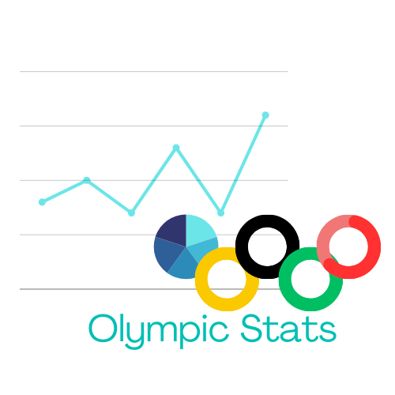

# Olympic Stats

    OlympicStats is a streamlit app for Olympic Games data visualization.

    I decided to do this as a summer project to learn data visualization and get familiar with the streamlit framework, while also improving on using the pandas library. For the theme, I was inspired by the 2024 Paris Games, and decided to combine my passion for sports with my passion for data.

The website is up on Streamlit Community Cloud, at https://olympicstats.streamlit.app